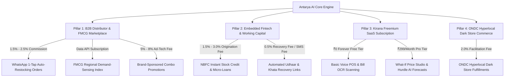

# 👑 ANTARYA (Dukan Ka Dimaag) — Comprehensive Business Model & Monetization Strategy
**The AI-Powered Operating System & Working Capital Multiplier for India's 13+ Million Kirana Stores**

---

## 🎯 Executive Summary for Hackathon Judges
India's retail backbone consists of **13+ Million unorganized Kirana stores** driving over **$800 Billion+ in annual grocery GMV** (~88% of total Indian retail). Yet, these stores run entirely on intuition, paper diaries (*Bahi-Khata*), and fragmented distributor visits.

While traditional startups (KhataBook, OkCredit) attempted to digitize them via basic ledger accounting (`Udhaar` tracking), **they hit severe monetization walls due to zero direct revenue attribution and low willingness-to-pay (WTP)**.

**Antarya (`Dukan Ka Dimaag`) changes the game entirely.** We are **NOT** just a digital bookkeeping app. Antarya is a **Pre-Transaction AI Demand & Profit Multiplier** powered by a **Two-Stage Hurdle Model, Price Elasticity Studio, Bhashini Multi-Language Voice POS, and 1-Tap WhatsApp Auto-Restocking**. Because Antarya directly **saves ₹14,000+ per month in prevented stockouts and optimizes working capital**, our business model unlocks a multi-billion dollar **B2B2C monetization flywheel** where Kirana owners, FMCG brands, wholesale distributors, and NBFC lenders all pay to participate.

---

## 💎 The 4-Pillar Multi-Tier Monetization Engine



---

### 🏛️ Pillar 1: B2B Distributor & FMCG Brand Monetization (Our #1 Primary Revenue Driver)
*We monetize the **Supply Chain & FMCG Brands** who desperately need real-time access and demand visibility into unorganized retail stores, allowing us to keep the core software free or ultra-low-cost for the Kirana owner.*

1. **1-Tap WhatsApp Auto-Restocking Commission (`1.5% – 2.5% Take Rate`)**
   * **The Mechanism:** When Antarya's Hurdle Model detects impending low stock before evening rush hours (`Shaam Ki Bheed`), it fires a **Stockout Risk Warning** (e.g., *"Fortune Sunflower Oil 1L will run out in 4 hours"*). The Kirana owner clicks **`1-Tap Auto-Order on WhatsApp`**.
   * **Monetization:** Antarya automatically routes this structured order payload directly to regional wholesale distributors, ONDC B2B nodes, or partner marketplaces (Udaan / JioMart Partner / Metro Cash & Carry). We charge the **distributor/supplier a 1.5% to 2.5% transaction fee** on the gross order value for zero-cost customer acquisition and guaranteed recurring demand.
   * **Why Distributors Pay:** Distributors spend 6–8% of their margin maintaining offline sales reps across narrow lanes. Antarya automates order capture at zero CAC.

2. **FMCG Predictive Demand-Sensing & Market Intelligence API (`B2B Enterprise SaaS`)**
   * **The Mechanism:** FMCG giants (HUL, ITC, Tata Consumer, Parle, Marico) suffer from a "bullwhip effect" and 30-day blind spots regarding real-time neighborhood consumer demand.
   * **Monetization:** Antarya aggregates anonymized, real-time demand shifts across thousands of neighborhood stores (`Kirana Demand Index API`). We sell tiered data subscriptions to FMCG brand managers and regional supply chain planners (`$10,000 to $50,000/month per enterprise client`) for hyper-local inventory staging and competitor product velocity tracking.

3. **Brand-Sponsored Trade Promotions & Price Elasticity Ad-Tech (`5% – 8% Platform Fee`)**
   * **The Mechanism:** Instead of blind billboard advertising, FMCG brands sponsor dynamic combo deals right inside Antarya's **Price Elasticity Studio** (e.g., *"Parle sponsors ₹5 off when Kirana sells Tea + Parle-G as a ₹99 Combo"*).
   * **Monetization:** Antarya charges brands a **5% to 8% ad-tech platform fee** on every sponsored trade promotion successfully triggered and verified at the Kirana counter via our Voice POS.

---

### 💳 Pillar 2: Embedded Fintech & Working Capital Monetization
*Unorganized Kiranas face severe cash-flow bottlenecks due to high `Udhaar` (customer credit) and lack of formal collateral for bank loans.*

1. **Instant Inventory Working Capital Credit (`1.5% – 3.0% NBFC Origination & Servicing Fee`)**
   * **The Mechanism:** Because Antarya captures exact daily revenue flow (`recordSale`, Voice POS) and invoice purchase history (`extractBill` OCR), our system assigns each store a real-time **Dukaan Health Score (e.g., 86/100 • Secure)**.
   * **Monetization:** When a Kirana owner needs ₹50,000 to restock before Diwali or wedding season, Antarya partners with embedded NBFCs and neo-banks (Lendingkart, BharatPe, FlexiLoans, IDFC First) to offer **1-Click Inventory Credit** directly at the checkout prompt. Antarya earns a **1.5% to 3.0% origination and ongoing servicing fee** on the loan disbursed, with **zero balance-sheet credit risk** to Antarya!

2. **Automated Khata & Udhaar Recovery Engine (`Pay-Per-Recovery Fee / SMS Gateway Tier`)**
   * **The Mechanism:** Antarya tracks aging customer credit (*"₹18,400 pending in Udhaar across 14 regular customers for >30 days"*). Kirana owners trigger automated, polite, multi-language WhatsApp/SMS payment reminders embedded with **1-Click UPI Autopay / Payment Links**.
   * **Monetization:** Antarya charges either a **small 0.5% convenience fee** on bad debts successfully recovered via our payment gateway links, or a flat **₹2 per automated SMS/WhatsApp recovery broadcast**.

---

### 💻 Pillar 3: Freemium Kirana SaaS Subscription (`Dukan Ka Dimaag Pro Tier`)
*We use a high-value Freemium wedge to achieve rapid viral distribution across millions of stores, while charging for advanced predictive power.*

| Feature / Capability | 🟢 Antarya Foundation (`Forever Free`) | 👑 Antarya AI Command Center (`Pro: ₹299/month or ₹2,999/year`) |
| :--- | :--- | :--- |
| **Voice POS & Billing** | ✅ Unlimited Voice POS (`Bol Kar Bill`) | ✅ Unlimited Voice POS + Multi-Counter Sync |
| **Invoice & Bill OCR Scanning** | ✅ Up to 30 Supplier Bills / Month (`extractBill`) | ✅ **Unlimited Invoice OCR** + Automated SKU Creation |
| **Digital Khata & Udhaar Tracking** | ✅ Basic Khata Register & Manual Reminders | ✅ **Automated 1-Tap WhatsApp Recovery Links + Aging Alerts** |
| **Bhashini Regional Languages** | ✅ Hindi & English Voice Support | ✅ **12+ Indian Regional Languages** (Marathi, Tamil, Telugu, Bangla, etc.) |
| **Two-Stage Hurdle AI Forecasting** | ❌ Basic Low Stock Count Only | ✅ **Full Hurdle Model Demand Prediction (`Shaam Ki Bheed` Alerts)** |
| **Price Elasticity & What-If Studio** | ❌ Not Available | ✅ **Interactive Price Elasticity Simulation & Profit Maximizer** |
| **SHAP Diagnostic Explanations** | ❌ Not Available | ✅ **Exact SHAP Factor Breakdown (Why footfall is +22% higher)** |
| **Multi-Store Management** | ❌ Single Store Only | ✅ **Manage 3+ Shops & Staff Permission Role Access** |

> [!IMPORTANT]
> **Why Kirana Owners Will Pay ₹299/Month (High Willingness-To-Pay Justification):**  
> If Antarya's Hurdle Model alerts the Kirana owner to restock *Fortune Oil* or *Amul Butter* just 4 hours before the evening peak (`Shaam Ki Bheed`), preventing an out-of-stock scenario and locking in **₹1,500+ in extra profit**, the ₹299 monthly subscription **pays for itself 5x over from a single AI recommendation!**

---

### 🚀 Pillar 4: ONDC Hyperlocal Dark Store Enablement (`B2C Commerce Gateway`)
*Transforming every neighborhood Kirana store into a 15-minute hyperlocal fulfillment center.*

* **The Mechanism:** As Antarya maintains exact, real-time SKU-level inventory counts (`Total Saaman: 23 Items`), we seamlessly connect the store as an **ONDC (Open Network for Digital Commerce) Seller Node**.
* **Monetization:** When nearby consumers order groceries on ONDC buyer apps (Paytm, Mystore, Pincode, Tata Neu), Antarya automatically routes and fulfills the order directly from the Kirana store's live inventory, earning a **2.0% platform facilitation fee** on every hyperlocal consumer transaction completed.

---

## 📈 Unit Economics & 3-Year Financial Projections ($50M ARR Roadmap)

```mermaid
bar-chart
    title Projected Annual Revenue Growth (in ₹ Crore)
    x-axis Year 1 (Seed / Regional Launch) : Year 2 (Growth / Multi-City) : Year 3 (Pan-India Scale)
    y-axis 0 : 450
    series Total Revenue
    Year 1 : 11.5
    Year 2 : 82.0
    Year 3 : 407.0
```

### Year 1: Seed / Regional Launch (`50,000 Active Kirana Stores`)
* **B2B WhatsApp Restocking GMV:** ₹500 Crore gross volume restocked → @ 2.0% Avg Commission = **₹10.0 Crore ($1.2M)**
* **SaaS Pro Subscriptions:** 10% paid conversion (5,000 Pro stores @ ₹3,000/year) = **₹1.5 Crore ($180K)**
* **Total Year 1 Revenue:** **~₹11.5 Crore ($1.38M ARR)**

### Year 2: Growth & Multi-City Expansion (`250,000 Active Kirana Stores`)
* **B2B Restocking GMV:** ₹3,000 Crore restocked → @ 2.0% Avg Commission = **₹60.0 Crore ($7.2M)**
* **SaaS Pro Subscriptions:** 11% paid conversion (27,500 Pro stores @ ₹3,200/year) = **₹8.8 Crore ($1.05M)**
* **Embedded NBFC Working Capital Loans:** ₹400 Crore credit disbursed → @ 2.0% origination fee = **₹8.0 Crore ($960K)**
* **FMCG Data & Brand Trade Ads:** 10 Regional FMCG Brand Clients = **₹5.2 Crore ($620K)**
* **Total Year 2 Revenue:** **~₹82.0 Crore ($9.8M ARR)**

### Year 3: Pan-India Dominance (`1,000,000 Active Kirana Stores`)
* **B2B Restocking GMV:** ₹15,000 Crore restocked → @ 2.0% Avg Commission = **₹300.0 Crore ($36.0M)**
* **SaaS Pro Subscriptions:** 12% paid conversion (120,000 Pro stores @ ₹3,500/year) = **₹42.0 Crore ($5.0M)**
* **Embedded NBFC Working Capital Loans:** ₹2,000 Crore credit disbursed → @ 2.0% origination fee = **₹40.0 Crore ($4.8M)**
* **FMCG Data & Brand Trade Ads:** 35+ Pan-India Enterprise FMCG Brand Accounts = **₹25.0 Crore ($3.0M)**
* **Total Year 3 Revenue:** **~₹407.0 Crore ($48.8M+ ARR)** with **78%+ Software/Platform Gross Margins!**

---

## 🛡️ Competitive Moats & Why Antarya Wins

| Competitor / Alternative | Their Core Focus | Why They Hit Monetization Walls | Antarya's Breathtaking Competitive Moat |
| :--- | :--- | :--- | :--- |
| **KhataBook / OkCredit** | Post-Transaction Credit/Udhaar Ledgers (`Passive Accounting`) | Zero direct revenue generation for the shop owner. When they attempted to monetize, users churned or refused to pay. | **Pre-Transaction Predictive Intelligence (`Active Revenue Generation`).** We predict demand peaks, simulate price elasticity, and actively generate profit *before* transactions occur. |
| **Udaan / JioMart B2B** | Supply-Side Wholesale Ordering App | High customer acquisition cost (CAC) and off-platform leakage. Kirana owners only open the app when stock is completely dead. | **Embedded POS + Supply Loop.** Because Antarya is the daily Voice POS (`Bol Kar Bill`), our system knows exact SKU depletion in real-time and triggers 1-tap WhatsApp restocking effortlessly. |
| **Traditional POS / Billing Hardware** | Desktop PC + Barcode Scanner Billing | Expensive hardware ($500+), requires English typing, rigid setup, and high maintenance for unorganized shopkeepers. | **100% Mobile-First & Voice-Native (`Bhashini AI`).** Kirana owners simply speak *"2 kilo atta, 1 litre tel"* in Hindi, Marathi, or Tamil. Zero hardware cost, zero learning curve. |

---

## 🎤 Ready-To-Present Pitch Summary for Hackathon Judges

> *"Respected Judges,*  
> *India's 13+ Million Kirana stores generate over $800 Billion in grocery sales, yet they operate completely blind—relying on paper diaries and guesswork.*  
> 
> *While previous startups built simple digital accounting ledgers like KhataBook, they struggled to monetize because passive bookkeeping doesn't put extra money into the shopkeeper's pocket.*  
> 
> ***Antarya (`Dukan Ka Dimaag`) solves the $800 Billion unorganized retail problem by building an AI-Powered Operating System and Working Capital Multiplier.***  
> 
> *We monetize through a **4-Pillar B2B2C Flywheel**:*  
> 1. *First, **B2B Distributor Restocking Commissions (1.5% to 2.5%)** when our Two-Stage Hurdle Model predicts low stock and triggers 1-click WhatsApp restocking.*  
> 2. *Second, **Embedded Fintech Credit & Working Capital Loans (1.5% to 3.0% origination fee)** backed by our real-time store health scores.*  
> 3. *Third, a **₹299/month SaaS Pro tier** that pays for itself 5 times over by saving just a single out-of-stock item during evening rush hours.*  
> 4. *And fourth, **FMCG Demand-Sensing Data APIs** that give brands unprecedented visibility into unorganized retail shifts.*  
> 
> *With our 100% Voice POS powered by Bhashini across 12 regional languages, we achieve zero-friction adoption—scaling to **1 Million Kiranas and $50 Million in high-margin ARR within 3 years.** Thank you!"*
